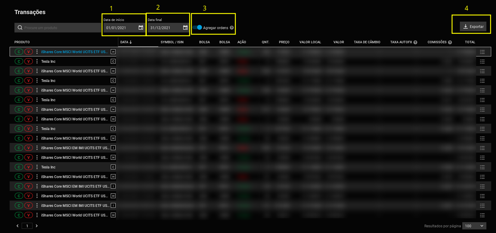

# Degiro2IRS-Autofiller
Cálcula e preenche automaticamente a tabela 9.2-A do Anexo J do IRS. Isto é, ajuda a combater a ineficiência da administração pública portuguesa.

Este script pega nas transações exportadas pela degiro e num ficheiro `.xml` que tem os conteúdos da declaração IRS e exporta a declaração IRS com a tabela J-9.2-A.

## Usage

```
usage: degiro2irs-autofiller.py [-h] -i IRS_FILE [-t TRANSACTIONS_FILE] -y IRS_YEAR -l LINE_OFFSET

Degiro2IRS-Autofiller

options:
  -h, --help            show this help message and exit
  -i IRS_FILE, --irs_file IRS_FILE
                        Ficheiro IRS .xml pre-preenchido gerado na plataforma IRS da AT.
  -t TRANSACTIONS_FILE, --transactions_file TRANSACTIONS_FILE
                        Ficheiro .csv com todas as transações da degiro até ao final do ano fiscal pretendido.
  -y IRS_YEAR, --year IRS_YEAR
                        Ano fiscal pretendido.
  -l LINE_OFFSET, --line_offset LINE_OFFSET
                        Primeira linha da tabela 9.2-A do Anexo J (lá diz "Nº Linha (XXX a ...)"
```

## How-to em 4 passos
Exemplo IRS 2021
### <a name="degiro_export"></a> 1. Exportar transações da degiro

Ir a Atividade->Transações na degiro

1) Meter data em que começaste a fazer trading na degiro. de modo a aparecerem **todas** as transações que fizeste até agora (mesmo que não seja o ano que estiveres a fazer o IRS. No meu caso, comecei só a fazer trading no início do ano 2021)
2) Meter a data do fim do ano fiscal (no nosso exemplo, 31/12/2021)
3) Meter `Agregar ordens`
4) Clicar em `Exportar` e selecionar o formato `CSV`



### <a name="irs_at_export"></a> 2. Auto-preenchimento IRS com as transações realizadas no ano fiscal pretendido

1) Primeiro é preciso gerar um .xml pre-preenchido diretamente da platafora IRS da AT. Para isso, faz um pre-preenchimento do IRS e cria o anexo J. De seguida, clica em "Gravar":


### 2. Gerar e preencher conteúdos da tabela J-9.2-a

1) Antes de correr o programa, é necessário determinar o `line_offset`, o nº da primeira linha da tabela J-9.2-a que varia em função da info que consta no teu IRS até ao momento. Para isso, vai à página do IRS da AT e vê o nº que lá aparece, neste exemplo é `951`:


2) Correr o `degiro2irs-autofiller.py` com os argumentos pretendidos
    - `irs_file` é o path para o ficheiro IRS pre-preenchido `.xml` exportado pela plataforma IRS da AT [neste passo](#irs_at_export).
    - `transactions_file` é o path para o ficheiro exportado pela degiro [neste passo](#degiro_export)
    - `year` ano fiscal pretendido
    - `line_offset` determinado acima

    Exemplo:

    ```
    python3 degiro2irs-autofiller.py --irs_file irs.xml --transactions_file Transactions.csv --year 2021 --line_offset 951
    ```

3) Confirmar se os valores imprimidos no terminal "Metrics by financial product" e "Total XXXX metrics" batem certo com os valores do relatório anual da degiro. É normal que haja erros de arredondamento (principalmente no total gains, no meu exemplo deu um erro de 0.5€)

Depois deves ver numa pasta `output/` o teu irs (`.xml`) já com os conteúdos da tabela J-9.2-a preenchidos.

## Limitações
- Isto só funciona com stocks que sejam negociadas em EUR. Não há suporte para taxa de câmbio, mas estás à vontade para adicionar esse feature.

- Se calhar só funciona se a plataforma da degiro estiver em PT. Se for esse o caso, é preciso mudar mudar o nome das colunas [aqui](https://github.com/francis2tm/Degiro2IRS-Autofiller/blob/ddf0c032b347164bb8144a1b702bb70d3e7693ac/degiro2irs-autofiller.py#L62)

## Licença
Degiro2IRS-Autofiller é licenciado através de uma licença GPL, conforme encontrado no arquivo [LICENSE](LICENSE).
## Termos de Responsabilidade
Todo o material neste repositório são prestados sem qualquer garantia. O conteúdo publicado neste repositório pode conter erros pelos quais os autores não se responsabilizam. Isto é **somente** uma ferramenta educativa. Este software não pode ser encarado como uma ferramenta validada pela autoridade tributária e nesse sentido deves ter o cuidado de verificar os resultados que este software produz. Para mais informações, lê a licença [LICENSE](LICENSE).